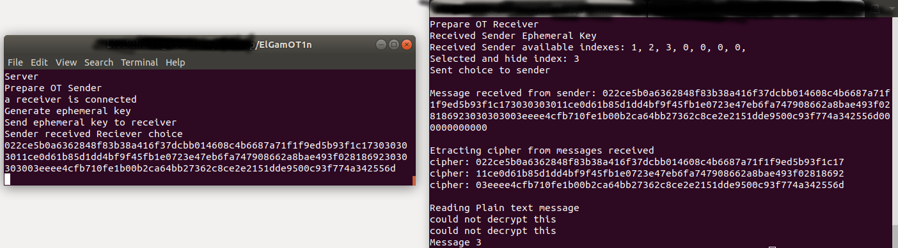

## 1-To-n Oblivious Transfer protocol based on ElGamal Cryptosystem
### What is an Oblivious Transfer
An Oblivious Transfer (OT) is a protocol between a sender *S* and a receiver *R* that allows *R* to obtain a message mi from a set of messages M = {m0,...,mn} held by *S* without *S* learning which message *R* obtained and with *R* only learning mi and no other messages in M.  
OT protocols have applications in areas such as secure multiparty computation and private set intersection. 
It this project, a *pure Rust Implementation* of a 1-to-n OT protocol based on ElGamal Cryptosystem is implemented.

### Preliminaries
#### ElGamal Cryptosystem
Given a cyclic group *G* of prime order *n* and one of its generator *g*, ElGamal Cryptosystem is a triple of polynomial time algorithms **(Gen, Enc, Dec)** with the following properties:
- The key generation algorithm **Gen** samples at random a value *x* belonging to the set *Z**n(set of integers using modular *n* arithmetic, i.e., modulo *n* is applied on all operations) and computes *y*=*g*x *mod n*. The value *x* is the secret key and the value *y* is the public key. 
- The encryption algorithm **Enc** takes as input a public key *y* and a message *m* belonging to the group *G*. Then, it samples at random a secret value *r* belonging to *Z**n. After, it computes *c*1 = *g*r *mod n* and *c*2 = m.*y*r *mod n* = m.*g*x.r *mod n*. Finally, it outpus (*c*1, *c*2).
- The decryption algorithm **Dec** takes as inputs a secret key *x* and a tuple of ciphertexts (*c*1, *c*2). Then, it computes *k* = *c*1x*mod n* = *g*x.r *mod n*. Using *k*, it computes *m* = *c*2.*k*-1*mod n* = m.*g*x.r.*g*-(x.r) *mod n*
#### The protocol
Following is a diagram that depicts the execution of the protocol:

### How to run (Linux)
Have the following components installed:
1. Rust >= version 1.45
2. OpenSSL >= version 1.1.1
 
Once the different environment dependencies have been installed, create an RSA private key and a signed 
certificate for the server (both in PEM format) using OpenSSL and place those files in
src/keyfile folder. 

Next, With the terminal working directory set to the project director, run the command `cargo build --release`  

* To launch the Server/Sender program, executes the command `./target/release/server`
* To launch the Client/Receiver program, executes the command `./target/release/client`

### Output example
Following is an example between a client and a server:

As we can see, The client selected message at index 3, and after, it is only able to obtain a plaintext version of message at index 3.

Thus, 1-n OT protocol is respected.

### Reference
1. D. Boneh and V. Shoup, ["A Graduate Course in Applied Cryptography"](https://toc.cryptobook.us/), Chapter 11
